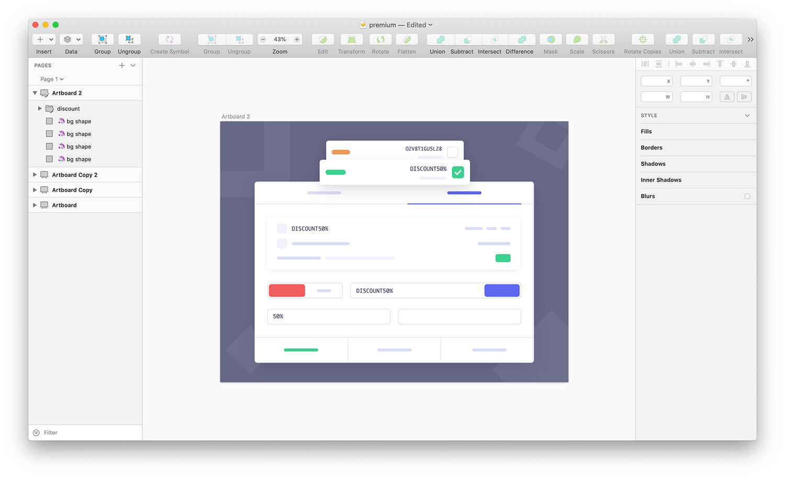

# Sketch Laboji

A sketch plugin for adding emoji on layer name like colorful labels.

## Installation

 - Download and open Laboji.zip
 - Double click on Laboji.sketchplugin file
 - That's it...

## Usage

Select any layer in Sketch and hit

( ⌃ ⇧ E ) to add random emoji label.
or use 'Laboji' from Plugins menu.

## Feedback

If you discover any issues , please send a message to me@rezamahmoudi.ir or find me on twitter @rezamahmoudii